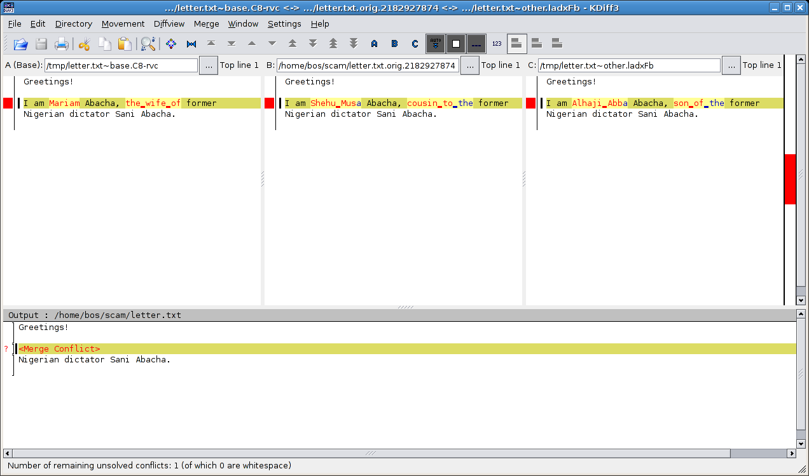

.. _chap:tour-merge:

A tour of Mercurial: merging work
=================================

We've now covered cloning a repository, making changes in a repository, and pulling or pushing changes from one repository into another. Our next step
is *merging* changes from separate repositories.

Merging streams of work
~~~~~~~~~~~~~~~~~~~~~~~

Merging is a fundamental part of working with a distributed revision control tool. Here are a few cases in which the need to merge work arises.

-  Alice and Bob each have a personal copy of a repository for a project they're collaborating on. Alice fixes a bug in her repository; Bob adds a new
   feature in his. They want the shared repository to contain both the bug fix and the new feature.

-  Cynthia frequently works on several different tasks for a single project at once, each safely isolated in its own repository. Working this way
   means that she often needs to merge one piece of her own work with another.

Because we need to merge often, Mercurial makes the process easy. Let's walk through a merge. We'll begin by cloning yet another repository (see how
often they spring up?) and making a change in it.

.. include:: examples/results/tour.merge.clone.lxo

We should now have two copies of ``hello.c`` with different contents. The histories of the two repositories have also diverged, as illustrated in
:ref:`fig:tour-merge:sep-repos <fig:tour-merge:sep-repos>`. Here is a copy of our file from one repository.

.. include:: examples/results/tour.merge.cat1.lxo

And here is our slightly different version from the other repository.

.. include:: examples/results/tour.merge.cat2.lxo

.. _fig:tour-merge:sep-repos:
.. figure:: figs/tour-merge-sep-repos.png

   Divergent recent histories of the my-hello and my-new-hello repositories

We already know that pulling changes from our ``my-hello`` repository will have no effect on the working directory.

.. include:: examples/results/tour.merge.pull.lxo

However, the ``hg pull`` command says something about “heads”.

Head changesets
---------------

Remember that Mercurial records what the parent of each change is. If a change has a parent, we call it a child or descendant of the parent. A head is
a change that has no children. The tip revision is thus a head, because the newest revision in a repository doesn't have any children. There are times
when a repository can contain more than one head.

.. _fig:tour-merge:pull:
.. figure:: figs/tour-merge-pull.png

   Repository contents after pulling from my-hello into my-new-hello

In :ref:`fig:tour-merge:pull <fig:tour-merge:pull>`, you can see the effect of the pull from ``my-hello`` into ``my-new-hello``. The history that was already present in
``my-new-hello`` is untouched, but a new revision has been added. By referring to :ref:`fig:tour-merge:sep-repos <fig:tour-merge:sep-repos>`, we can see that the *changeset ID*
remains the same in the new repository, but the *revision number* has changed. (This, incidentally, is a fine example of why it's not safe to use
revision numbers when discussing changesets.) We can view the heads in a repository using the ``hg heads`` command.

.. include:: examples/results/tour.merge.heads.lxo

Performing the merge
--------------------

What happens if we try to use the normal ``hg update`` command to update to the new tip?

.. include:: examples/results/tour.merge.update.lxo

Mercurial is telling us that the ``hg update`` command won't do a merge; it won't update the working directory when it thinks we might want to do a
merge, unless we force it to do so. (Incidentally, forcing the update with ``hg update -C`` would revert any uncommitted changes in the working directory.)

To start a merge between the two heads, we use the ``hg merge`` command.

.. include:: examples/results/tour.merge.merge.lxo

We resolve the contents of ``hello.c`` This updates the working directory so that it contains changes from *both* heads, which is reflected in both
the output of ``hg parents`` and the contents of ``hello.c``.

.. include:: examples/results/tour.merge.parents.lxo

Committing the results of the merge
-----------------------------------

Whenever we've done a merge, ``hg parents`` will display two parents until we ``hg commit`` the results of the merge.

.. include:: examples/results/tour.merge.commit.lxo

We now have a new tip revision; notice that it has *both* of our former heads as its parents. These are the same revisions that were previously
displayed by ``hg parents``.

.. include:: examples/results/tour.merge.tip.lxo

In :ref:`fig:tour-merge:merge <fig:tour-merge:merge>`, you can see a representation of what happens to the working directory during the merge, and how this affects the
repository when the commit happens. During the merge, the working directory has two parent changesets, and these become the parents of the new
changeset.

.. _fig:tour-merge:merge:
.. figure:: figs/tour-merge-merge.png

   Working directory and repository during merge, and following commit

We sometimes talk about a merge having *sides*: the left side is the first parent in the output of ``hg parents``, and the right side is the second.
If the working directory was at e.g. revision 5 before we began a merge, that revision will become the left side of the merge.

Merging conflicting changes
~~~~~~~~~~~~~~~~~~~~~~~~~~~

Most merges are simple affairs, but sometimes you'll find yourself merging changes where each side modifies the same portions of the same files.
Unless both modifications are identical, this results in a *conflict*, where you have to decide how to reconcile the different changes into something
coherent.

.. _fig:tour-merge:conflict:
.. figure:: figs/tour-merge-conflict.png

   Conflicting changes to a document

:ref:`fig:tour-merge:conflict <fig:tour-merge:conflict>` illustrates an instance of two conflicting changes to a document. We started with a single version of the file; then
we made some changes; while someone else made different changes to the same text. Our task in resolving the conflicting changes is to decide what the
file should look like.

Mercurial doesn't have a built-in facility for handling conflicts. Instead, it runs an external program, usually one that displays some kind of
graphical conflict resolution interface. By default, Mercurial tries to find one of several different merging tools that are likely to be installed on
your system. It first tries a few fully automatic merging tools; if these don't succeed (because the resolution process requires human guidance) or
aren't present, it tries a few different graphical merging tools.

It's also possible to get Mercurial to run a specific program or script, by setting the HGMERGE environment variable to the name of your preferred
program.

Using a graphical merge tool
----------------------------

My preferred graphical merge tool is ``kdiff3``, which I'll use to describe the features that are common to graphical file merging tools. You can see
a screenshot of ``kdiff3`` in action in :ref:`fig:tour-merge:kdiff3 <fig:tour-merge:kdiff3>`. The kind of merge it is performing is called a *three-way merge*, because there
are three different versions of the file of interest to us. The tool thus splits the upper portion of the window into three panes:

-  At the left is the *base* version of the file, i.e. the most recent version from which the two versions we're trying to merge are descended.

-  In the middle is “our” version of the file, with the contents that we modified.

-  On the right is “their” version of the file, the one that from the changeset that we're trying to merge with.

In the pane below these is the current *result* of the merge. Our task is to replace all of the red text, which indicates unresolved conflicts, with
some sensible merger of the “ours” and “theirs” versions of the file.

All four of these panes are *locked together*; if we scroll vertically or horizontally in any of them, the others are updated to display the
corresponding sections of their respective files.

.. _fig:tour-merge:kdiff3:

   Using kdiff3 to merge versions of a file

For each conflicting portion of the file, we can choose to resolve the conflict using some combination of text from the base version, ours, or theirs.
We can also manually edit the merged file at any time, in case we need to make further modifications.

There are *many* file merging tools available, too many to cover here. They vary in which platforms they are available for, and in their particular
strengths and weaknesses. Most are tuned for merging files containing plain text, while a few are aimed at specialised file formats (generally XML).

A worked example
----------------

In this example, we will reproduce the file modification history of :ref:`fig:tour-merge:conflict <fig:tour-merge:conflict>` above. Let's begin by creating a repository with a
base version of our document.

.. include:: examples/results/tour-merge-conflict.wife.lxo

We'll clone the repository and make a change to the file.

.. include:: examples/results/tour-merge-conflict.cousin.lxo

And another clone, to simulate someone else making a change to the file. (This hints at the idea that it's not all that unusual to merge with yourself
when you isolate tasks in separate repositories, and indeed to find and resolve conflicts while doing so.)

.. include:: examples/results/tour-merge-conflict.son.lxo

Having created two different versions of the file, we'll set up an environment suitable for running our merge.

.. include:: examples/results/tour-merge-conflict.pull.lxo

In this example, I'll set HGMERGE to tell Mercurial to use the non-interactive ``merge`` command. This is bundled with many Unix-like systems. (If
you're following this example on your computer, don't bother setting HGMERGE. You'll get dropped into a GUI file merge tool instead, which is much
preferable.)

.. include:: examples/results/tour-merge-conflict.merge.lxo

Because ``merge`` can't resolve the conflicting changes, it leaves *merge markers* inside the file that has conflicts, indicating which lines have
conflicts, and whether they came from our version of the file or theirs.

Mercurial can tell from the way ``merge`` exits that it wasn't able to merge successfully, so it tells us what commands we'll need to run if we want
to redo the merging operation. This could be useful if, for example, we were running a graphical merge tool and quit because we were confused or
realised we had made a mistake.

If automatic or manual merges fail, there's nothing to prevent us from “fixing up” the affected files ourselves, and committing the results of our
merge:

.. include:: examples/results/tour-merge-conflict.commit.lxo

.. _sec:tour-merge:fetch:

Simplifying the pull-merge-commit sequence
~~~~~~~~~~~~~~~~~~~~~~~~~~~~~~~~~~~~~~~~~~

The process of merging changes as outlined above is straightforward, but requires running three commands in sequence.

::

    hg pull -u
    hg merge
    hg commit -m 'Merged remote changes'

In the case of the final commit, you also need to enter a commit message, which is almost always going to be a piece of uninteresting “boilerplate”
text.

It would be nice to reduce the number of steps needed, if this were possible. Indeed, Mercurial is distributed with an extension called ``fetch`` that
does just this.

Mercurial provides a flexible extension mechanism that lets people extend its functionality, while keeping the core of Mercurial small and easy to
deal with. Some extensions add new commands that you can use from the command line, while others work “behind the scenes,” for example adding
capabilities to Mercurial's built-in server mode.

The ``fetch`` extension adds a new command called, not surprisingly, ``hg fetch``. This extension acts as a combination of ``hg pull -u``,
``hg merge`` and ``hg commit``. It begins by pulling changes from another repository into the current repository. If it finds that the changes added a
new head to the repository, it updates to the new head, begins a merge, then (if the merge succeeded) commits the result of the merge with an
automatically-generated commit message. If no new heads were added, it updates the working directory to the new tip changeset.

Enabling the ``fetch`` extension is easy. Edit the ``.hgrc`` file in your home directory, and either go to the ``extensions`` section or create an
``extensions`` section. Then add a line that simply reads “``fetch=``”.

::

    [extensions]
    fetch =

(Normally, the right-hand side of the “``=``” would indicate where to find the extension, but since the ``fetch`` extension is in the standard
distribution, Mercurial knows where to search for it.)

Renaming, copying, and merging
~~~~~~~~~~~~~~~~~~~~~~~~~~~~~~

During the life of a project, we will often want to change the layout of its files and directories. This can be as simple as renaming a single file,
or as complex as restructuring the entire hierarchy of files within the project.

Mercurial supports these kinds of complex changes fluently, provided we tell it what we're doing. If we want to rename a file, we should use the
``hg rename``\  [1]_ command to rename it, so that Mercurial can do the right thing later when we merge.

We will cover the use of these commands in more detail in :ref:`chap:daily.copy\ <chap:daily.copy\>`.

.. [1]
   If you're a Unix user, you'll be glad to know that the ``hg rename`` command can be abbreviated as ``hg mv``.
